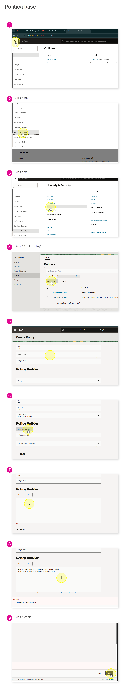
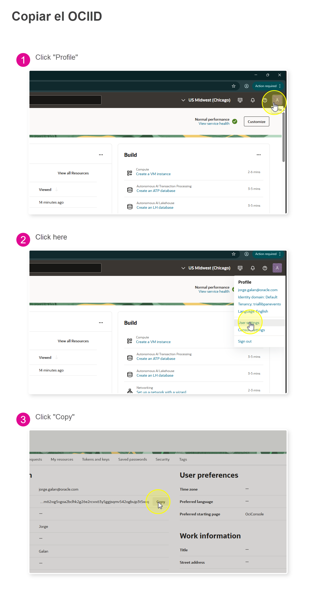

# Setup Automático de Servicios Base (OCI)

En esta guía vamos a desplegar, con **OCI Resource Manager**, los servicios base para trabajar con los laboratorios.

## Servicios que crea el stack

- `compartment_name`: `ora26ai`
- `policy_name`: `ora26ai`
- `vcn_display_name`: `vcn-agent`
- `vm_display_name`: `AgentFactoryVM`
- `atp_display_name`: `ora26ai-atp`
- `atp_db_name`: `ORA26AI`
- `aidp_display_name`: `AIDP_DEMO`

## Stack ZIP

Repositorio (vista):  
`https://github.com/valentinafeve/oracle-labs-ai/blob/main/utils/oci-foundation-stack-rm.zip`

URL principal para despliegue automático (la que funciona de forma estable):

`https://github.com/valentinafeve/oracle-labs-ai/raw/refs/heads/main/utils/oci-foundation-stack-rm.zip`

## Paso 1. Política previa e identificación de usuario

Antes de crear el stack, valida que exista esta política en tenancy:

```text
Allow group Administrators to manage orm-stacks in tenancy
Allow group Administrators to manage orm-jobs in tenancy
```

- <details>
  <summary>• Ver captura: política en IAM</summary>

  
  </details>

Luego ubica el `OCID` del usuario que ejecutará el despliegue (se usa en variables del stack).

- <details>
  <summary>• Ver captura: cómo obtener User OCID</summary>

  
  </details>

## Paso 2. Despliegue automático con botón

Puedes usar el botón para ir directo al menú de creación del stack en Resource Manager:

[](https://cloud.oracle.com/resourcemanager/stacks/create?zipUrl=https%3A%2F%2Fgithub.com%2Fvalentinafeve%2Foracle-labs-ai%2Fraw%2Frefs%2Fheads%2Fmain%2Futils%2Foci-foundation-stack-rm.zip)

Nota:
- Si usas URL tipo `blob` o una URL no directa al `.zip`, puede aparecer `InvalidParameter(400)`.

## Paso 3. Variables mínimas en Resource Manager

En la pantalla de variables, completa como mínimo:

- `tenancy_ocid`
- `region` (ejemplo: `us-chicago-1`)
- `api_key_user_ocid`

Valores recomendados para laboratorio:

- `allow_any_user_manage_all_resources = true`
- `enable_object_storage_artifacts = true`
- `enable_bucket_object_uploads = true`
- `enable_phase_2 = true`
- `store_api_private_key_in_bucket = true`
- `store_vm_ssh_keys_in_bucket = true`
- `enable_aidp_workbench = true`

## Paso 4. Ejecutar Plan y Apply

1. Crear el stack.
2. Ejecutar `Plan`.
3. Ejecutar `Apply`.
4. Revisar `Outputs` del job para obtener:
   - IP de la VM
   - OCID de ATP
   - Bucket de artefactos
   - Llaves/credenciales (si están habilitadas para laboratorio)

## Nota importante

Si luego no puedes destruir el stack, normalmente es porque AIDP crea recursos adicionales (logging, buckets, notebooks) que deben eliminarse primero para vaciar el compartment.


# Paso 5. Resultados útiles del stack

Al finalizar el despliegue, el stack crea un bucket en el compartment `ora26ai`, con un nombre similar a `ora26ai-secrets-*****`.

Dentro de ese bucket, en la carpeta `KEYS`, encontrarás archivos como:

- `oci_config`
- `oci_api_private_key.pem`

Estos archivos se usarán durante el laboratorio para autenticar distintos servicios de OCI.

Recomendación:

- Descarga estos archivos y guárdalos en una carpeta central del evento para facilitar el trabajo de los participantes.
- Si prefieres no usar los artefactos generados por el stack, también puedes crear las llaves y credenciales manualmente.
