# Guía de Instalación de N8N

## 📋 Descripción
N8N es una plataforma de automatización de flujos de trabajo (workflow automation) que permite conectar diferentes servicios y aplicaciones de manera visual y sin necesidad de programar.

## 🔧 Requisitos Previos

### Node.js
N8N requiere Node.js para funcionar. Asegúrate de tener instalado Node.js versión 18 o superior.

**Verificar si Node.js está instalado:**
```powershell
node --version
```

**Si no tienes Node.js instalado:**
1. Visita [nodejs.org](https://nodejs.org/)
2. Descarga la versión LTS (recomendada)
3. Ejecuta el instalador y sigue las instrucciones

## 🚀 Instalación de N8N

### Método 1: Usando npx (Recomendado)
Este método no requiere instalación global y siempre usa la versión más reciente:

```powershell
npx n8n
```


## 📁 Ejecución de n8n

**Ejecutar N8N**
   ```powershell
   npx n8n
   ```
### Verificar versión
```powershell
npx n8n --version
```


## 🌐 Acceso a la Interfaz Web

Una vez que N8N esté ejecutándose:

1. **URL de acceso:** http://localhost:5678
2. **Puerto por defecto:** 5678
3. **Abrir automáticamente:** Presiona `o` en la terminal para abrir el navegador

## 👤 Configuración Inicial

### Primera vez:
1. Abre tu navegador en http://localhost:5678
2. Crea tu cuenta de administrador
3. Configura tu nombre de usuario y contraseña
4. ¡Comienza a crear tus primeros workflows!

### Instalación de nodos de Oracle

Instalar paquetes adicionales

Instalar el paquete de n8n-nodes-oracle-cloud

Para instalar los nosods de Oracle pordemos navegar a

> Settings > Community nodes > Install community nodes

y allí vamos a buscar el paquete

```
n8n-nodes-oracle-cloud
```

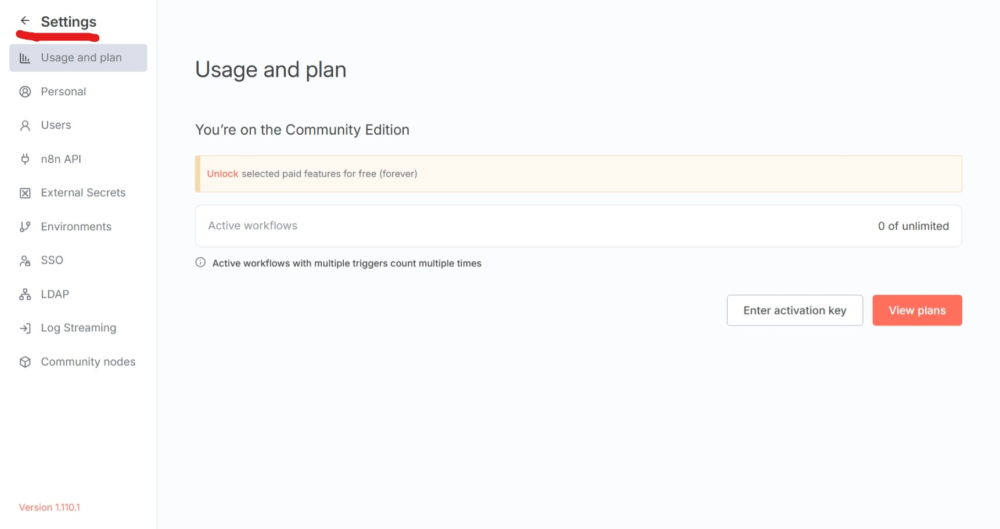

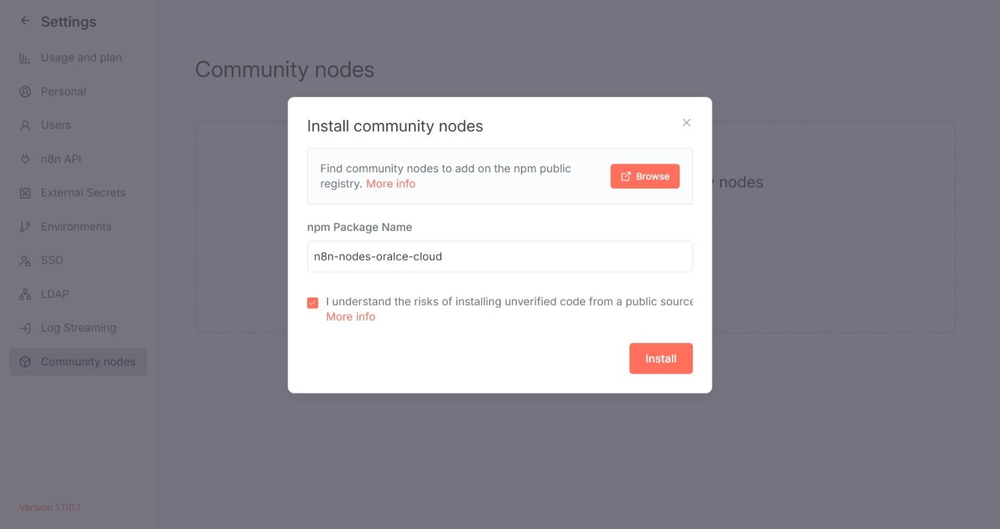

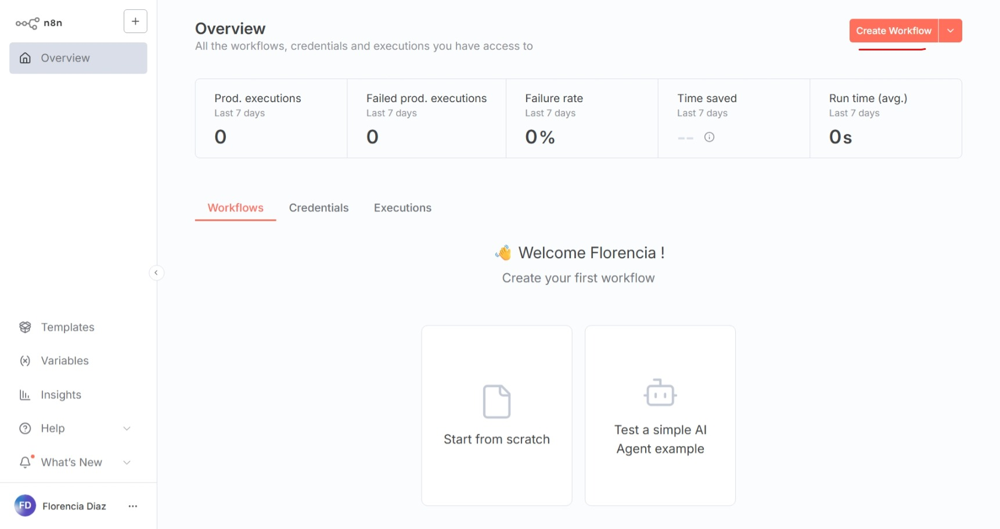

## 📸 Guía Paso a Paso

A continuación se detallan los pasos para construir el siguiente workflow, el cuál está dividido en wl workflow de vectorización de archivos y el workflow de chat.

A continuación es posible encontrar una guía en portugués con subtítulos 

[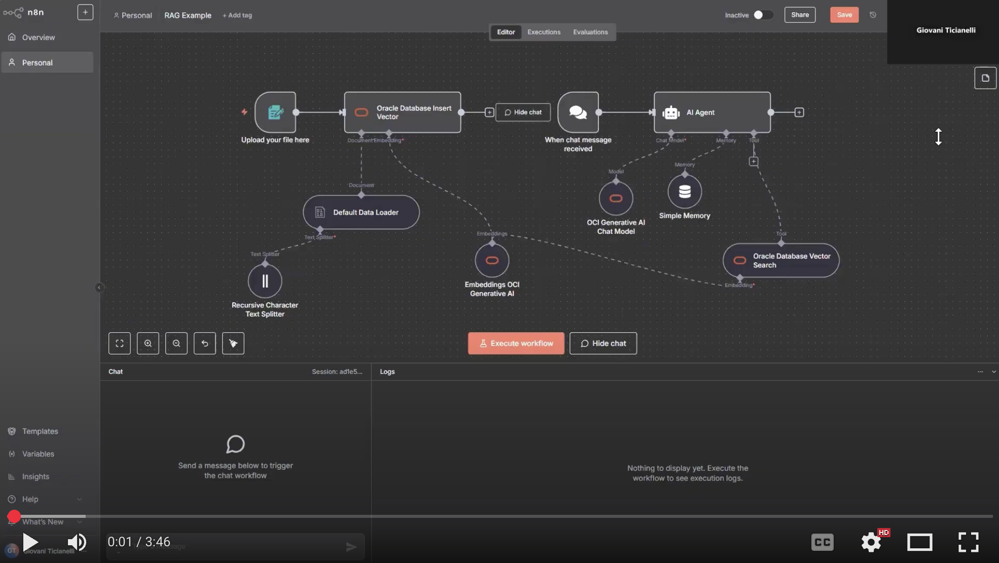](https://youtu.be/f0p52rJ7yd0)


El propósito de este notebook es implementar el siguiente workflow.

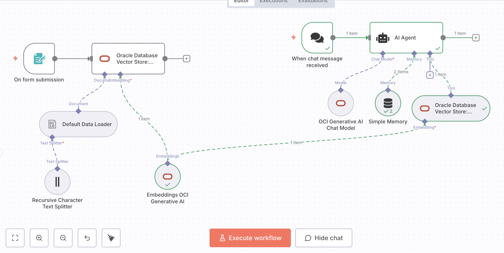


## 🔤 Implementación del workflow

En el siguiente workflow disennaremos un agente que responde a preguntas relacionadas con algunos textos. Este workflow se compone de dos flujos, en el primer flujo vamos a dividir los archivos en secciones y a generar un vector para cada una de estas secciones. Luego, este vector se almacenará en la base de datos vectorial.

#### 1. On form submission

> Este nodo mostrará un formulario que nos permitirá adjuntar el archivo con el que queremos alimentar al agente

Para iniciar el workflow, crearemos el nodo con la siguiente información.

* Nombre: "On form submission"

**Parameters**

- Form Title: subir archivos
- Form elements: 
   - Field name: Subir archivos
   - Element Type: File

- Respond When: Form is submitted

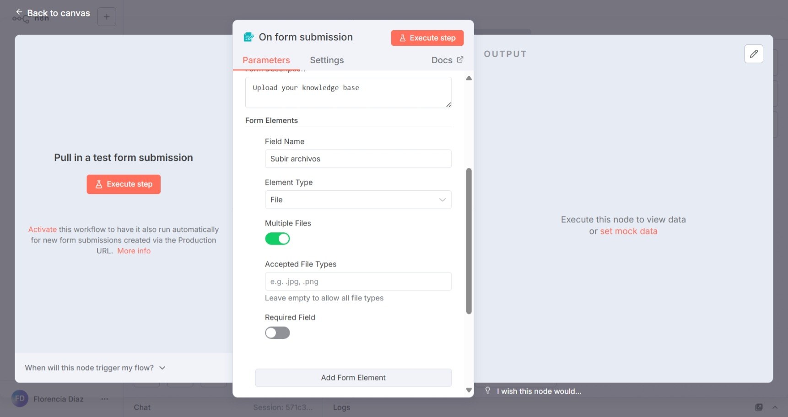

#### 2. Oracle Database Vector Store Insert

> Este nodo nos permitirá insertar elementos en la base de datos vectorial.

* Nombre: "Oracle Database Vector Store: Insert"

**Parameters**
- Table Name: vectores
- Clear Table: Activado (limpia tabla antes de insertar)

#### 2.1 Oracle Database account
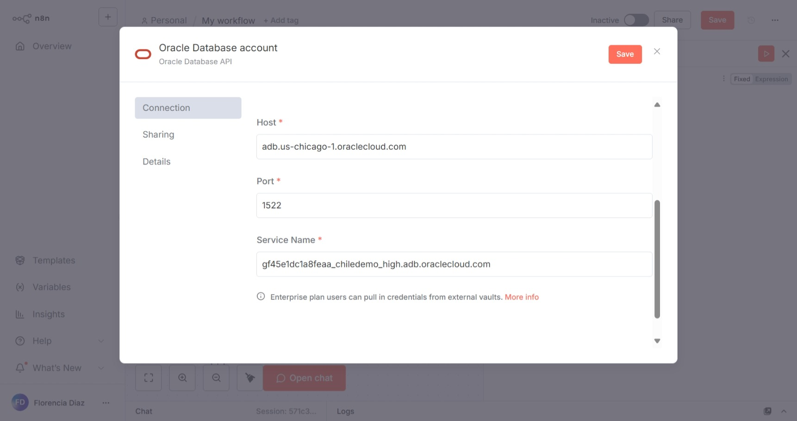

El valor de cada campo se puede encontrar en algún *Connection string*, disponible en la sección *Database Connection*, es recomendable usar el Connection String medium.

Para obtener los valores de este nodo podemos navegar a la consola de Oracle a la sección *Database Connection*

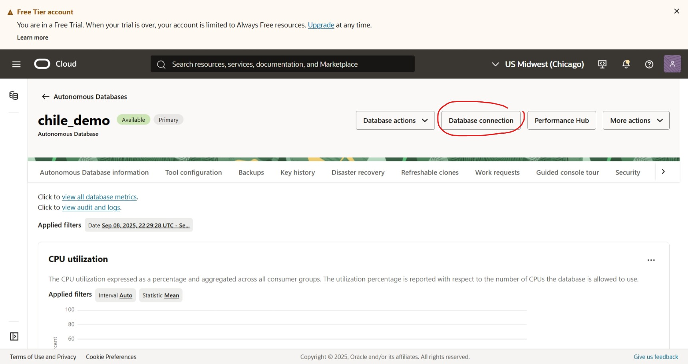

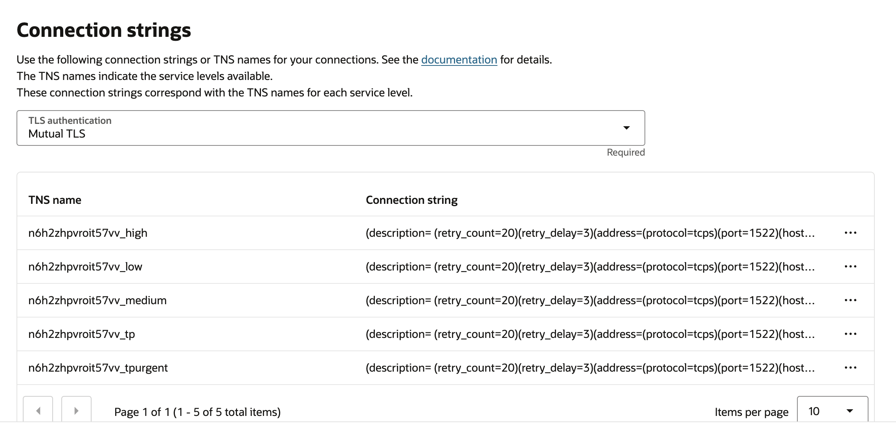

Recomendamos usar el Conenction String medium.

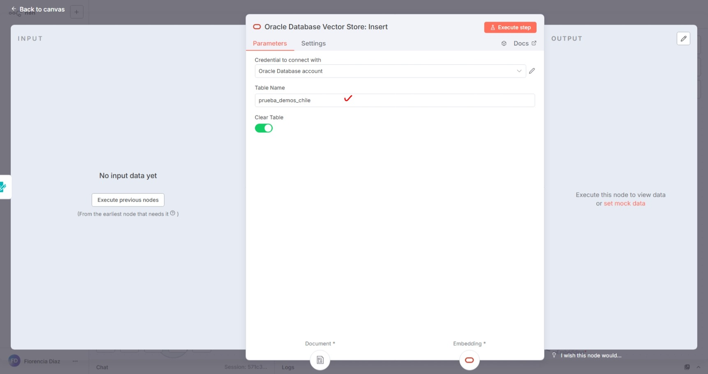

#### 3. Conexión de nodos Default Data Loader

> El propósito de este nodo es cargar y procesar archivos binarios, detectando el formato automáticamente

* Nodo: "Default Data Loader"

**Parameters**
- Type of Data: Binary
- Mode: Load All Input Data
- Data Format: Automatically Detect by Mime Type
- Text Splitting: Custom
- Options: Split Pages in PDF (activado)

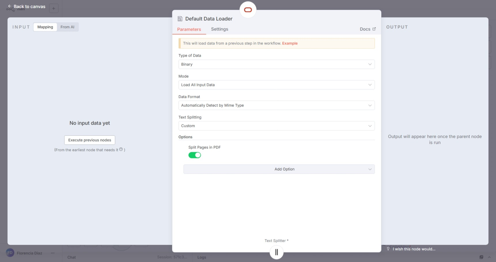

#### 4. Recursive Character Text Splitter

> El propósito de este nodo es dividir texto en chunks manejables para embeddings

* Nodo: "Recursive Character Text Splitter"

**Parameters**
- Chunk Size: 500
- Chunk Overlap: 25
- Options: No properties

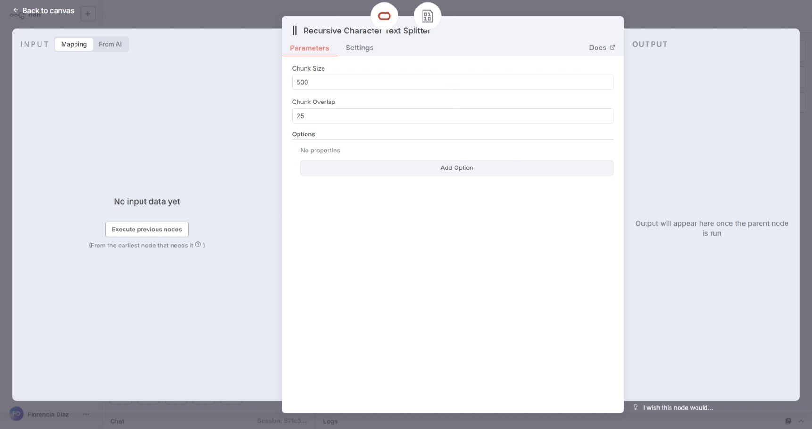

#### 5. Embeddins OCI Generative AI

> El propósito de este nodo es generar los embeddings o vectores para cada chunk de información.

* Nombre: "Embeddings OCI Generative AI*

**Parameters**

- Compartment ID: Aquí escribiremos el id del compartment, es un valor que empieza por ocid1.compartment o ocid1.tenancy y está disponible en https://cloud.oracle.com/identity/compartments

- On Demand Model Name or ID: Aquí seleccionaremos el nombre del modelo, recomendamos cohere.embed-multilingual-v3.0

- Credential to connect with: Aquí crearemos una nueva credencial y seguiremos la documentación en la sección Credentials 

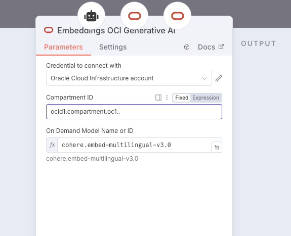

#### 5.1 Credential to connect with

**Parameters**

- User OCID: El id de nuestro usuario, es un valor que empieza con ocid1.user.oc1..

- Tenancy OCID: El id de nuestro tenancy, es un valor que empieza con  ocid1.tenancy.oc1..

- Key Fingerprint: El fingerprint de nuestra credencial, es un valor que tiene un formato similar a A0:B1:E4

- Region: La región en la que fue creada nuestra cuenta, puede ser: "sa-saopaulo-1", "us-chicago-1", "uk-london-1", "eu-frankfurt-1", "ap-osaka-1", etc...

- Private Key: El contenido del archivo .pem descargado en la creación de la credencial

- Private Key Passphrase: Passphrase de nuestra key, si no hay una passphrase, podemos dejar en blanco.

Aquí finaliza el flujo de procesamiento de los documentos, el siguiente paso es crear el agente de IA que consume la información vectorizada.

El primer paso es crear un nodo de chat, este nodo iniciará el flujo ya que queremos que el agente se ejecute cada vez que el usuario inicia un mensaje.

#### 6. When chat message received

* Nombre: When chat message received

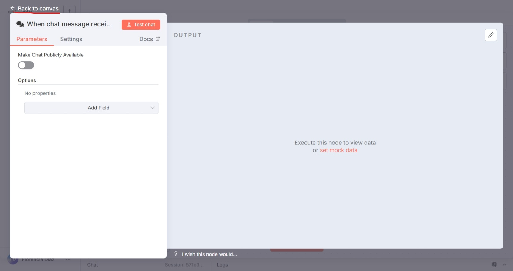
#### 7. AI Agent

> Este nodo nos permitirá ejecutar un agente que buscará información relevante en una base de datos para responder a las preguntas del usuario.

**Parameters**

- Source for Prompt (User Message): Define below
- Prompt: ```Eres un asistente muy amable que responde a las preguntas del usuario.
Usuario:
{{ $json.chatInput }}```

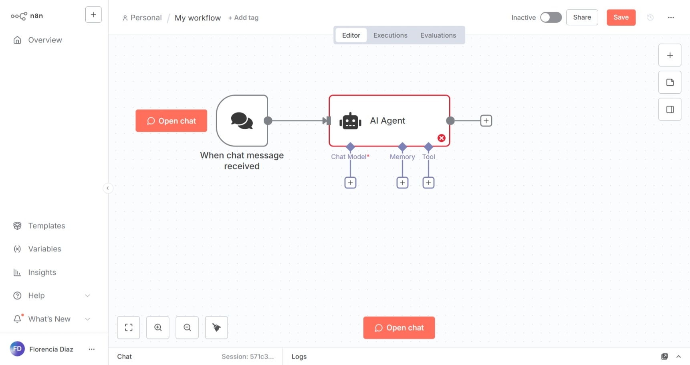

#### 8. OCI Generative AI Chat Model

> Este nodo corresponde al modelo de IA generativa que usará el agente para responder a las preguntas.

**Parameters**

- Credential to connect with: Aquí podemos usar la credencial creada en el step 5.1
- Compartment ID: Podemos usar el mismo compartment del step 5
- On Demand Model Name or Id: Seleccionaremos el modelo que queremos usar para generar respuestas, dependiendo de nuestra región, algunos modelos pueden estar o no disponibles. Algunos modelos para probar son: "meta.llama-4-maverick-17b-128e-instruct-fp8", "meta.llama-3.3-70b-instruct"

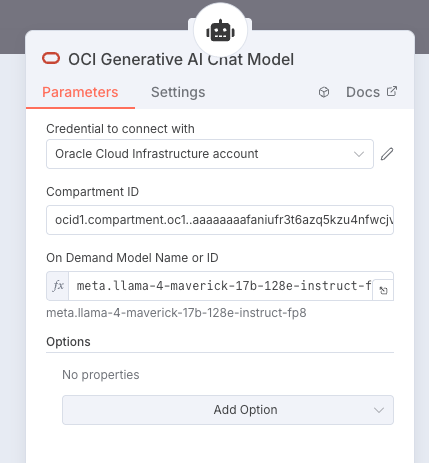

#### 9. Simple Memory

> Es la memoria simple que el agente usará para almacenar la conversación

#### 10.Vector Store Tool

> Esta es la herramienta usada por el agente para buscar información relevante en los documentos.

**Parameters**

- Credential to connect with: Aquí podemos usar la credencial creada en el step 5.1
- Name: vd_tool
- Table name: vectores
- Limit: 4
- distance Strategy: EUCLIDEAN_DISTANCE

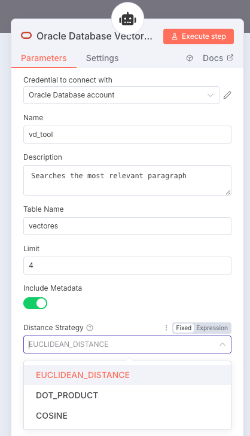

### Uso del agente


## 📚 Recursos Adicionales

- **Documentación oficial:** https://docs.n8n.io/
- **Comunidad:** https://community.n8n.io/
- **Templates:** https://n8n.io/workflows/

