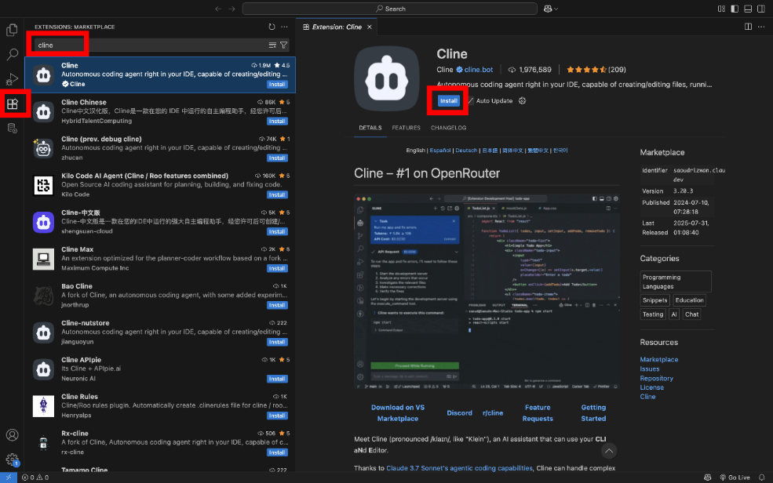

Servidor MCP de Oracle SQLcl con Oracle AI Database

# Oracle SQLcl MCP Server with Oracle AI Database

## Introducción

En este laboratorio, aprenderá a configurar y utilizar el servidor MCP SQLcl con un agente AI en VS Code. El servidor MCP SQLcl le permite conectar su base de datos Oracle AI a asistentes AI, ya sea Copilot, Cline, Claude Desktop o cualquier otra herramienta que admita el protocolo de contexto de modelo (MCP).

El servidor MCP actúa como un puente entre la base de datos y las herramientas de IA, lo que le permite utilizar el lenguaje natural para interactuar con sus datos, ejecutar consultas SQL y ejecutar comandos de base de datos. En lugar de escribir SQL desde cero, puede describir lo que desea hacer y dejar que el asistente de IA maneje los detalles técnicos.

Para esta demostración, usaremos VS Code con Copilot, pero los pasos también funcionan con otros agentes compatibles con MCP. Una vez configurado, podrás utilizar el lenguaje natural para enumerar conexiones, ejecutar scripts SQL y crear un juego de trivia simple.

Tiempo de laboratorio estimado: 20 minutos

## Objetivo

Al final de este laboratorio, podrá:

Descargar y configurar SQLcl (con soporte de MCP)

Instalar y configurar las extensiones de SQL Developer y Cline para VS Code

Conectarse a la base de datos de Oracle AI mediante una cartera

Configure los valores de MCP en VS Code

Utilice el servidor MCP SQLcl con un agente AI para mostrar las conexiones, ejecutar SQL y crear una tabla de juego de trivia

## Requisitos previos

En este laboratorio se asume que tiene:

Oracle Java 17 o 21 instalado

Acceso a una base de datos Oracle AI (FreeSQL, LiveSQL o una base de datos autónoma con cartera)

Credenciales de cuenta Oracle

VSCode instalado en su máquina

Acceso a Internet

## Tarea 1: Descargar su cartera (si ya tienes la wallet de una BD de lab anteriores puedes seguir con el Tarea 2)

¿Qué es una cartera?  Una cartera es un archivo seguro que contiene las credenciales de conexión y los certificados necesarios para acceder a Oracle Autonomous Database. Garantiza que la conexión a la base de datos esté cifrada y autenticada.

Por qué lo necesita: vamos a utilizar la cartera para conectar la extensión de VSCode de SQL Developer a nuestra base de datos autónoma

En la página inicial de la base de datos autónoma, haga clic en la conexión a la base de datos y descargue la cartera de la base de datos.

Proporcione a la cartera una contraseña. Puedes hacer que tu contraseña sea lo que quieras, simplemente no la olvides. (Sugiero usar la misma contraseña para el taller) y hacer clic en Descargar en la parte inferior derecha

Contraseña: OracleAIworld2025

Verificar la descarga: compruebe que se haya descargado un archivo .zip en la computadora (normalmente en la carpeta Descargas). Este archivo contiene las credenciales de cartera.

## Tarea 2: Instalación de la extensión SQL Developer para el VSCode

Qué hace esta extensión: Oracle SQL Developer Extension permite trabajar con bases de datos Oracle AI y gestionarlas en VS Code.

Por qué lo necesitas: esta extensión almacenará los detalles de conexión de tu base de datos

Abra VS Code (VSCode), si no lo tienes descárgalo de Internet e instálalo ( ), luego de instalar procedemos a abrir VS Code y vaya a la vista Extensiones.

Busque "Oracle SQL Developer" y haga clic en Instalar. O instálelo directamente desde .

Una vez instalada, abra la extensión SQL Developer en la barra de actividades.

Haga clic en Create Connection

Introduzca los detalles de conexión de cartera:

nombre de conexión: AIWord-HOL

usuario: ADMIN

contraseña: [contraseña que se definio en el despliegue de la BD]

marque la casilla para guardar la contraseña

Seleccione la lista desplegable de tipo de conexión. Seleccione: Cloud Wallet

Haga clic en Choose file y seleccione la cartera

Pruebe la conexión para verificar que funciona y, a continuación, Guarde

Verificar la configuración: debería aparecer la nueva conexión "AIWorld-HOL" en el panel SQL Developer Extension. Si la prueba de conexión falla, compruebe las credenciales y el archivo de cartera.

## Tarea 3: Instalación de la extensión de cline

Cline es un agente de código abierto de codificación de IA.

En VS Code Extensions, busque "Cline" e instálelo.

Abra Cline en la barra de actividades.

Configure el proveedor de AI. Tiene varias opciones:

Utilice el servicio gratuito de Cline (haga clic en Introducción gratuita)

Utilice su propia clave de API de OpenAI, Anthropic u otros proveedores

Uso de Oracle Code Assist con Oracle SSO

Para esta demostración, mostraremos la opción gratuita. Haga clic en Introducción gratuita si desea utilizar el servicio de Cline.

Si utiliza el servicio gratuito de Cline, se le pedirá que se registre. Siga las instrucciones para crear una cuenta (esto es opcional; puede omitirlo si tiene sus propias claves de API).

Configure el modelo de IA:

Haga clic en el icono de engranaje para abrir la configuración de cline

Haga clic en Configuración de API.

Seleccione su proveedor y modelo de IA preferido. Para la opción gratuita, elija uno de los modelos gratuitos disponibles de Cline.

## Tarea 4: Instalación de SQLcl

Qué es SQLcl: SQLcl es la moderna interfaz de línea de comandos de Oracle para trabajar con bases de datos de Oracle AI. Incluye la funcionalidad del servidor MCP que permite a los asistentes de IA y agentes de codificación interactuar con la base de datos de forma segura.

Por qué necesita la versión 25.2 o posterior: la función del servidor MCP se introdujo en la versión 25.2 de SQLcl, por lo que las versiones anteriores no funcionarán para este laboratorio.

Opciones de instalación:

Opción 1: Descargar directamente (recomendado)

Descarga SQLcl (25.2 o posterior) desde . La herramienta SQLcl se ofrece bajo la .

Descomprima la carpeta descargada en una ubicación que recordará. Para esta demostración, usaremos la carpeta Descargas, pero puedes elegir cualquier ubicación.

Opción 2: Instalar a través de Homebrew (usuarios de Mac)

brew install --cask sqlcl

Verifique la instalación:

Si ha descargado el archivo zip, debería ver una carpeta denominada sqlcl con un directorio bin en su interior.

Si ha utilizado Homebrew, SQLcl estará disponible en el sistema PATH

Tenga en cuenta la ruta completa a la instalación de SQLcl: la necesitará para la siguiente tarea

## Tarea 5: Configuración de Cline con el servidor MCP SQLcl

Qué hace esta configuración: este paso conecta Cline (su asistente AI) con el servidor MCP SQLcl. Una vez configurado, Cline podrá ejecutar comandos de base de datos en su nombre mediante solicitudes de lenguaje natural.

Por qué es importante esta conexión: sin esta configuración, Cline no puede acceder a la base de datos. El servidor MCP actúa como un puente seguro, permitiendo a Cline ejecutar consultas SQL y gestionar las conexiones a la base de datos de forma segura.

En VS Code, haga clic en la extensión Cline en la parte izquierda y haga clic en el ícono MCP Servers (Servidores MCP) en la parte superior de la pantalla.

Haga clic en Configurar y, a continuación, en Configurar servidores MCP. Esto abre un archivo de configuración de JSON.

Actualice la configuración de JSON con la ruta SQLcl. Sustituya el texto del marcador de posición por la ruta real a la instalación de SQLcl desde la tarea 4.

Para SQLcl descargado: utilice la ruta de acceso a la carpeta descomprimida Para la instalación de Homebrew: utilice /opt/homebrew/bin/sql (o /usr/local/bin/sql en macs anteriores)

Copiar

{

"mcpServers": {

"sqlcl": {

"command": "[ACTUALIZAR ESTO CON SU RUTA A SQLCL]/bin/sql",

"args": ["-mcp"]

}

}

}

Rutas de ejemplo:

Descargado: /Users/yourname/Downloads/sqlcl/bin/sql

Homebrew: /opt/homebrew/bin/sql

Nota: Para configurar y utilizar SQLcl, es requisito previo tener Java instalado.

En caso de que aparezca una ventana solicitando su instalación, simplemente procede a instalar Java antes de continuar con la configuración.

Guarde el archivo. Debe ver que SQLcl aparece en Installed MCP Servers. Si aparece el botón en rojo dar click en el bton de refrescar.

Verifique la configuración:

SQLcl debe aparecer en la lista "Installed MCP Servers"

Si no lo ve, compruebe la ruta de archivo en la configuración de JSON.

Si hay un error, asegúrese de que la instalación de SQLcl funciona probándola en un terminal

Haga clic en cualquier parte de la barra SQLcl para ampliarla. Verá las herramientas de base de datos disponibles que Cline ahora puede utilizar:

Herramientas disponibles:

list-connections: muestra las conexiones de base de datos guardadas.

connect: se conecta a una base de datos específica

desconectar: se desconecta de forma segura de la base de datos

run-sqlcl: ejecuta los comandos SQLcl.

SQL: ejecuta consultas SQL

Haga clic en Listo para completar la configuración.

Lo que ha logrado: Cline ahora puede comunicarse de forma segura con su base de datos Oracle AI a través del servidor MCP. ¡Está listo para empezar a utilizar el lenguaje natural para interactuar con sus datos!

## Tarea 6: Uso del servidor MCP

Lo que logrará: en esta tarea, utilizará el lenguaje natural para interactuar con la base de datos de Oracle AI mediante Cline y el servidor MCP. Enumerarás tus conexiones, cargarás datos de ejemplo y crearás una aplicación sencilla.

Descripción de los Modos de Cline:

Modo de plan: la clonación crea un plan y solicita su aprobación antes de ejecutarlo

Modo Act: la clonación se ejecuta inmediatamente (se utiliza con precaución)

La seguridad es lo primero: mantenga siempre desactivada la opción "Aprobación automática" para revisar lo que Cline desea hacer antes de que actúe.

En Cline, asegúrese de que está en modo Plan y de que la opción "Aprobación automática" está desactivada.

⚠ IMPORTANTE: para conocer las mejores prácticas de seguridad, asegúrese de que la opción "Aprobación automática" esté desactivada.

Active el modo de plan. A continuación, en el área de entrada Tarea de Cline, escriba el siguiente mensaje:

Copy

Usando el servidor mcp sqlcl, muestre mis conexiones a la base de datos.

Cline creará un plan y pedirá permiso para utilizar la herramienta list-connections. Revise la solicitud y haga clic en Aprobar si parece correcta.

La salida devolverá la lista de conexiones disponibles para el servidor MCP SQLcl. Aquí podemos ver la conexión AIWorld-HOL que hemos realizado anteriormente en el laboratorio

Qué estamos creando: una aplicación trivia con preguntas del historial de Oracle. En primer lugar, necesitamos crear los datos. Cree un nuevo archivo en VS Code denominado trivia-data.sql y copie este script:

(haga clic en) SQL Script

Copiar: Borrar la tabla si ya existe (opcional para un restablecimiento limpio)

DROP TABLE si existe trivia_questions CASCADE CONSTRAINTS;

-- Crear la tabla de trivia

CREAR TABLA trivia_questions (

id            NUMBER GENERATED BY DEFAULT AS IDENTITY PRIMARY KEY (Clave principal),

question_text VARCHAR2(500) NO NULO,

answer_text   VARCHAR2(200) NO NULO,

categoría      VARCHAR2(50)  DEFAULT 'Oracle History',

dificultad    VARCHAR2(20)  DEFAULT 'Medium'

);

-- Insertar trivia de historial de Oracle

INSERT INTO trivia_questions (question_text, answer_text, dificultad) VALUES

('¿En qué año se fundó Oracle?', '1977', 'Medio');

INSERT INTO trivia_questions (question_text, answer_text, dificultad) VALUES

('¿Qué versión principal de Oracle Database introdujo PL/SQL?', 'Oracle 6', 'Medium');

INSERT INTO trivia_questions (question_text, answer_text, dificultad) VALUES

('¿Qué versión introdujo Real Application Clusters (RAC)?', 'Oracle 9i', 'Medium');

INSERT INTO trivia_questions (question_text, answer_text, dificultad) VALUES

('Oracle 10g hizo hincapié en qué modelo de computación en su marca?', 'Grid computing', 'Easy');

INSERT INTO trivia_questions (question_text, answer_text, dificultad) VALUES

('Oracle 12c introdujo una nueva arquitectura para la consolidación. ¿Cómo se llama?', 'Multitenant (CDB/PDB)', 'Easy');

INSERT INTO trivia_questions (question_text, answer_text, dificultad) VALUES

('¿Qué empresa adquirió Oracle en 2010 que lo convirtió en administrador de Java y MySQL?', 'Sun Microsystems', 'Easy');

INSERT INTO trivia_questions (question_text, answer_text, dificultad) VALUES

('Exadata, sistema de ingeniería de Oracle para bases de datos, debutó en qué década?', '2000s (2008)', 'Medium');

INSERT INTO trivia_questions (question_text, answer_text, dificultad) VALUES

('¿En qué año se anunció por primera vez la base de datos autónoma?', '2017', 'Medio');

INSERT INTO trivia_questions (question_text, answer_text, dificultad) VALUES

('¿Cuál es el nombre interno del motor relacional que inspiró el nombre del producto original de Oracle?', 'Oracle (de un nombre en clave de proyecto de la CIA)', 'Hard');

INSERT INTO trivia_questions (question_text, answer_text, dificultad) VALUES

('¿Quién fue el primer cliente de Oracle?', 'La CIA', 'Medio');

INSERT INTO trivia_questions (question_text, answer_text, dificultad) VALUES

('¿Qué nombre de versión de Oracle introdujo el concepto de "c" para la nube?', 'Oracle 12c', 'Easy');

-- Guardar los datos

CONFIRMAR;

Guarde el archivo en VS Code.

Ahora pida a Cline que cargue los datos en la base de datos. Introduzca esta petición de datos:

Copie el comando

Utiliza run-sqlcl para cargar el @/trivia-data.sql en la conexión a la base de datos AIWorld-HOL

Revise el plan: Cline le mostrará lo que desea hacer. Esta es su oportunidad para verificar los comandos SQL antes de ejecutarlos. Haga clic en Aprobar si todo parece correcto.

Verificar que se han cargado los datos: el servidor MCP debe confirmar la ejecución correcta y debe ver la confirmación de que se ha creado la tabla y se han insertado los datos.

Ahora vamos a utilizar nuestra base de datos para construir algo útil. Introduzca esta petición de datos:

CopyNow

crearme una aplicación web de trivia simple para una presentación de conferencia. La aplicación debe mostrar las preguntas y los datos que almacenamos en la base de datos. En aras de la simplicidad, hacer un sitio estático.

Revise con atención: Cline creará un plan para crear la aplicación. Revise las consultas SQL que planea utilizar para asegurarse de que coinciden con la estructura de datos.

CopyNow

respóndeme la siguiente pregunta " Which release introduced Real Application Clusters (RAC)?" utilizando la tabla trivia_Questions

⚠ Advertencia: Revise siempre las sentencias SQL que Cline desea ejecutar. Puede modificar la petición de datos para que sea más específica sobre qué consultas utilizar.

Qué debe ver: Cline creará una aplicación de trivia de trabajo utilizando los datos de la base de datos, lo que demuestra el poder de la interacción de la base de datos en lenguaje natural.

Desconectar de forma segura: cuando termine, solicite a Cline que cierre la conexión a la base de datos:

CopyPlease

desconéctese de la conexión a la base de datos.

Apruebe la solicitud de desconexión para garantizar una limpieza adecuada.

El servidor MCP SQLcl registra todas las operaciones en la tabla DBTOOLS$MCP_LOG. Puede consultar esta tabla para ver un historial de todos los scripts SQL, PL/SQL y ejecutados en su nombre.

---
**Confidential – Oracle Internal**