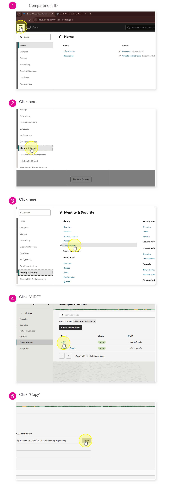

# RAG

En este laboratorio aprenderás a construir paso a paso un sistema de Retrieval-Augmented Generation (RAG) utilizando Oracle Autonomous Database 26ai y los servicios de Oracle Generative AI. A lo largo del ejercicio, configurarás credenciales, políticas y recursos en OCI, cargarás y vectorizarás documentos directamente en la base de datos, y finalmente combinarás búsqueda semántica con modelos de lenguaje para generar respuestas contextualizadas en lenguaje natural.

El objetivo es demostrar cómo Oracle permite implementar arquitecturas RAG de forma nativa, segura y eficiente, sin necesidad de mover datos fuera de la base de datos, aprovechando capacidades avanzadas como vectores, modelos ONNX, y LLMs bajo demanda. Al finalizar el laboratorio, tendrás una solución funcional que integra datos, embeddings y generación de texto en un solo flujo end-to-end.

## Paso 1: Creación del api key

Para crear el api key, podemos usar el siguiente paso a paso [Creación de un api key paso a paso](../utils/Creación%20de%20credenciales.md)

Al agregar la key podremos ver los detalles de la configuración

```yaml
[DEFAULT]
user=ocid1.user...
fingerprint=a8::::
tenancy=ocid1.tenancy...
region=us-chicago-1
```

Estos datos nos servirán para la configuración en la app.

> Copia el contenido de la credencial en un blog de notas.


## Paso 2: Creación de un compartment.

Es necesario crear un compartment para gestionar nuestros recursos y accesos de forma ordenada. Para esto vamos a la sección de compartments


<aside>
💡

Identity and security > Compartments

</aside>


Aquí podemos crear el compartment con los siguientes datos:

```sql
Name: ora26ai
Description: Testing AI in Oracle
```


### 2.1 Compartment ID

> Para varios laboratorios vamos a requerir él ``Compartment ID`` este se puede obtener como se observa a continuación. 👇

1. Ve a **Identity & Security** → **Compartments**.
2. Busca y selecciona el compartment `ora26ai`.
3. En los detalles, copia el valor de **OCID**.

<details>
<summary>📸 Obtener Compartment ID </summary>



</details>

4. Copialo en un blog de notas.

## Paso 3: Creación de una política

El paso siguiente es crear una política

<aside>
💡

Identity and Security > Policies

</aside>

En la página principal de las políticas podemos hacer clic en Create Policy


```sql
Name: ora26ai
Description: Allows any user to manage all the resources in the compartment
```

Hacemos clic en Show manual editor, esto abrirá un cuadro de texto en donde podemos agregar la siguiente información

```sql
Allow any-user to manage all-resources in compartment ora26ai
```

Para finalizar hacemos clic en Create


## Paso 4: Creación de una base de datos

<aside>
💡

**Oracle AI Database > Autonomous AI Databases**

</aside>

Es importante seleccionar nuestro compartment, una vez seleccionado procedemos a la creación.


Para la creación de la base de datos es importante seleccionar las siguientes características

```sql
Workload type: Transaction Processing
Database version: 26ai ⚠️ Importante. Muchas características de IA están soportadas desde la versión 23ai
ECPU Count: 4 Recomendamos un número mayor a 2
Storage: Desde 512GB será suficiente para el demo
Access type: Secure Access from Everywhere
```

Los demás campos pueden quedar por defecto, una vez seleccionada la contraseña, la página de la base de datos entrará en estado Provisioning, el cuál tardará al rededor de 5 minutos.


### Paso 4.1: Ingreso a la consola SQL

Cuando la base de datos esté en estado available podemos acceder a esta y ejecutar comandos SQL


## Paso 5: Configuración de credenciales

Para realizar la conexión a los servicios de inteligencia artificial, es necesario que la base de datos cuente con las credenciales adecuadas que le permitan acceder a dichos servicios.

Creamos una credencial llamada OCI_CRED con los datos generados a partir del api key.

```jsx
declare
  jo json_object_t;
begin
  jo := json_object_t();
  jo.put('user_ocid','ocid1.user.oc1....');
  jo.put('tenancy_ocid','ocid1.tenancy.oc1....');
  jo.put('compartment_ocid','ocid1.compartment.oc1....');
  jo.put('private_key','MII....Cb3');
  jo.put('fingerprint','a0:b1:c2');
  dbms_output.put_line(jo.to_string);
  dbms_vector.create_credential(
    credential_name   => 'OCI_CRED',
    params            => json(jo.to_string));
end;
```

Si sucede algún error con al realizar la conexión al modelo y necesitamos volver a crear la credencial, podemos ejecutar el siguiente comando. Este comando eliminará la credencial creada. Este comando debe utilizarse sólo si es necesario crear nuevamente la credencial OCI_CRED.

```
BEGIN
   DBMS_CLOUD.DROP_CREDENTIAL('OCI_CRED');
END;
```


Autorizamos la llamada al endpoint

```jsx
BEGIN
   -- allow connecting to outside hosts
    DBMS_NETWORK_ACL_ADMIN.APPEND_HOST_ACE(
        host => '*',
        ace => xs$ace_type(privilege_list => xs$name_list('connect'),
                           principal_name => 'ADMIN',
                           principal_type => xs_acl.ptype_db));

END;
```

Una vez las credenciales han sido creadas correctamente, es importante validar que la base de datos pueda realizar **requests** al servicio de inteligencia artificial generativa, confirmando así que la conexión se encuentra correctamente configurada.

## Paso 6: Creación de funciones y configuración del ambiente

Es importante cambiar el valor ocid1.compartment. por nuestro compartment

```jsx
set serveroutput on

DECLARE
  p_region   VARCHAR2(200) := 'us-chicago-1';
  p_endpoint VARCHAR2(500) := 'https://inference.generativeai.'||p_region||'.oci.oraclecloud.com';
  p_compartment_ocid VARCHAR2(200) := 'ocid1.compartment...';

  resp DBMS_CLOUD_TYPES.resp;
  json_response CLOB;
BEGIN
  resp := DBMS_CLOUD.send_request(
    credential_name => 'OCI_CRED',
    uri            => p_endpoint || '/20231130/actions/chat',
    method         => 'POST',
    body => UTL_RAW.cast_to_raw(
		  JSON_OBJECT(
		    'compartmentId' VALUE p_compartment_ocid,
		    'servingMode' VALUE JSON_OBJECT(
		      'modelId'     VALUE 'meta.llama-4-maverick-17b-128e-instruct-fp8',
		      'servingType' VALUE 'ON_DEMAND'
		    ),
		    'chatRequest' VALUE JSON_OBJECT(
		      'messages' VALUE JSON_ARRAY(
		        JSON_OBJECT(
		          'role' VALUE 'USER',
		          'content' VALUE JSON_ARRAY(
		            JSON_OBJECT(
		              'type' VALUE 'TEXT',
		              'text' VALUE 'Qué le sucedió a la familia Gómez Ramírez'
		            )
		          )
		        )
		      ),
		      'apiFormat' VALUE 'GENERIC',
		      'maxTokens' VALUE 4000,
		      'isStream' VALUE FALSE,
		      'numGenerations' VALUE 1,
		      'frequencyPenalty' VALUE 0,
		      'presencePenalty' VALUE 0,
		      'temperature' VALUE 1,
		      'topP' VALUE 1.0,
		      'topK' VALUE 1
		    )
		  )
		)
		  );

  json_response := DBMS_CLOUD.get_response_text(resp);
  dbms_output.put_line(json_response);
EXCEPTION
    WHEN OTHERS THEN
        RAISE;
END;
```

Es necesario crear las tablas que permitirán almacenar los documentos procesados, incluyendo tanto el texto original de los documentos como sus vectores correspondientes.

```jsx
CREATE TABLE IF NOT EXISTS "TB_DATA"
    (
    ID    INTEGER GENERATED BY DEFAULT ON NULL AS IDENTITY
          ( START WITH 1 CACHE 20 ) PRIMARY KEY,
    file_name      VARCHAR2 (900) ,
    file_size      INTEGER ,
    file_type       VARCHAR2 (100) ,
    file_content    BLOB
    )
```

Creamos la tabla para almacenar los vectores

```jsx
CREATE TABLE IF NOT EXISTS "TB_VECTOR_DATA"
  (    "VEC_ID" NUMBER(*,0) NOT NULL ENABLE,
  "EMBED_ID" NUMBER,
  "EMBED_DATA" VARCHAR2(4000 BYTE),
  "EMBED_VECTOR" VECTOR,
    FOREIGN KEY (VEC_ID) REFERENCES TB_DATA(ID)
)
```

Copiamos un PDF almacenado en un bucket de OCI a un directorio DATA_PUMP_DIR de la base de datos

```jsx
BEGIN
   DBMS_CLOUD.GET_OBJECT(
   credential_name => 'OCI_CRED',
   object_uri => 'https://objectstorage.us-chicago-1.oraclecloud.com/n/idi1o0a010nx/b/labs/o/relatorelato-a.pdf',
   directory_name => 'DATA_PUMP_DIR');
END;
```

El motor de la base de datos Oracle tiene la capacidad de ejecutar inferencias utilizando modelos de *machine learning* directamente dentro de la base de datos.

La base de datos soporta diferentes tipos de modelos, como regresión, clasificación y vectorización.

En este laboratorio, se utilizará un modelo de **vectorización previamente entrenado** para generar representaciones vectoriales de los documentos.

Copiamos un modelo de machine learning para el directorio DATA_PUMP_DIR de la base de datos

```jsx
BEGIN
   DBMS_CLOUD.GET_OBJECT(
   credential_name => 'OCI_CRED',
   object_uri => 'https://objectstorage.us-chicago-1.oraclecloud.com/n/idi1o0a010nx/b/labs/o/modeall-MiniLM-L6.onnx',
   directory_name => 'DATA_PUMP_DIR');
END;
```

Cargamos el modelo

-- Importamos un modelo ONNX
--   Podemos encontrar más información aquí https://docs.oracle.com/en/database/oracle/oracle-database/23/arpls/dbms_vector1.html#GUID-7F1D7992-D8F7-4AD9-9BF6-6EFFC1B0617A
--
--   Download de modelos:
--  OML4PY 2.0 https://blogs.oracle.com/machinelearning/post/oml4py-leveraging-onnx-and-hugging-face-for-advanced-ai-vector-search
--  ou https://huggingface.com/models
--

```jsx
BEGIN

  DBMS_VECTOR.LOAD_ONNX_MODEL(directory=>'DATA_PUMP_DIR',
                              file_name=>'modeall-MiniLM-L6.onnx',
                              model_name=>'all_MiniLM_L6',
                              metadata=>JSON('{"function" : "embedding", "embeddingOutput" : "embedding", "input": {"input": ["DATA"]}}')
                               );

END;
```

Guardamos el PDF en la tabla

```jsx
insert into "TB_DATA"(file_name,file_size,file_type,file_content)
values  ('relatorelato-a.pdf',
         dbms_lob.getlength(to_blob(bfilename('DATA_PUMP_DIR', 'relatorelato-a.pdf'))),
         'PDF',
         to_blob(bfilename('DATA_PUMP_DIR', 'relatorelato-a.pdf') )
        )
```

--
-- generatndo vector a partir del PDF
-- etapa 1: extraccion de texto
-- etapa 2: crear piezas del texto
-- etapa 3: aplicaicon de modelo de machine learning
--

```jsx
INSERT into "TB_VECTOR_DATA" ( vec_id, embed_id, embed_data, embed_vector)
 select  id, embed_id, text_chunk ,embed_vector
 from TB_DATA dt
             CROSS JOIN TABLE(
                 dbms_vector_chain.utl_to_embeddings(
                     dbms_vector_chain.utl_to_chunks(
                         dbms_vector_chain.utl_to_text(dt.file_content),
                         json('{"by":"words","max":"100","split":"sentence","normalize":"all"}')
                     ),
                     json('{"provider":"database", "model":"ALL_MINILM_L6"}')
                 )
             )  t
             CROSS JOIN JSON_TABLE(
                 t.column_value,
                 '$[*]' COLUMNS (
                     embed_id NUMBER PATH '$.embed_id',
                     text_chunk VARCHAR2(4000) PATH '$.embed_data',
                     embed_vector CLOB PATH '$.embed_vector'
                 )
         ) AS et
where dt.file_name = 'relatorelato-a.pdf'
```

Cuando finalice el proceso de inserción, es posible realizar una búsqueda de similitudes

```jsx
SELECT embed_data
FROM TB_VECTOR_DATA,
       (SELECT VECTOR_EMBEDDING(  ALL_MINILM_L6   USING 'Qué le sucedió a la familia Gómez Ramírez' AS data) as embedding) query_vector
ORDER BY VECTOR_DISTANCE(EMBED_VECTOR, query_vector.embedding, COSINE)
FETCH APPROX FIRST 4 ROWS ONLY
```

A partir de los resultados de la búsqueda de similitudes es posible generar una respuesta en lenguaje natural usando los servicios de IA generativa. Definiremos una función

Es importante cambiar el valor ocid1.compartment. por nuestro compartment

```sql
CREATE OR REPLACE EDITIONABLE FUNCTION "ADMIN"."GENERATE_TEXT_RESPONSE_GEN" (
  p_user_question VARCHAR2
) RETURN CLOB IS

  messages        CLOB := EMPTY_CLOB();
  output_text     CLOB := EMPTY_CLOB();

  p_region           VARCHAR2(200) := 'us-chicago-1';
  p_endpoint         VARCHAR2(200) := 'https://inference.generativeai.'||p_region||'.oci.oraclecloud.com';
  p_compartment_ocid VARCHAR2(200) := 'ocid1.compartment...';

  resp          DBMS_CLOUD_TYPES.resp;
  json_response CLOB;

  l_root     JSON_OBJECT_T;
  l_chat     JSON_OBJECT_T;
  l_choices  JSON_ARRAY_T;
  l_choice0  JSON_OBJECT_T;
  l_message  JSON_OBJECT_T;
  l_content  JSON_ARRAY_T;
  l_part0    JSON_OBJECT_T;

  l_text     VARCHAR2(32767);

BEGIN
  -- Build RAG context (top 4 chunks)
  FOR message_cursor IN (
    SELECT embed_data
    FROM TB_VECTOR_DATA,
         (SELECT VECTOR_EMBEDDING(ALL_MINILM_L6 USING p_user_question AS data) as embedding) query_vector
    ORDER BY VECTOR_DISTANCE(EMBED_VECTOR, query_vector.embedding, COSINE)
    FETCH APPROX FIRST 4 ROWS ONLY
  ) LOOP
    messages := messages || '- ' || message_cursor.embed_data || CHR(10) || CHR(10);
  END LOOP;

  -- Append user question
  messages := messages
              || 'Pregunta del usuario:' || CHR(10)
              || p_user_question;

  -- Call OCI GenAI Chat
  resp := DBMS_CLOUD.send_request(
    credential_name => 'OCI_CRED',
    uri             => p_endpoint || '/20231130/actions/chat',
    method          => 'POST',
    body            => UTL_RAW.cast_to_raw(
      JSON_OBJECT(
        'compartmentId' VALUE p_compartment_ocid,
        'servingMode' VALUE JSON_OBJECT(
          'modelId'     VALUE 'meta.llama-4-maverick-17b-128e-instruct-fp8',
          'servingType' VALUE 'ON_DEMAND'
        ),
        'chatRequest' VALUE JSON_OBJECT(
          'messages' VALUE JSON_ARRAY(
            JSON_OBJECT(
              'role' VALUE 'USER',
              'content' VALUE JSON_ARRAY(
                JSON_OBJECT(
                  'type' VALUE 'TEXT',
                  'text' VALUE messages
                )
              )
            )
          ),
          'apiFormat' VALUE 'GENERIC',
          'maxTokens' VALUE 4000,
          'isStream' VALUE FALSE,
          'numGenerations' VALUE 1,
          'frequencyPenalty' VALUE 0,
          'presencePenalty' VALUE 0,
          'temperature' VALUE 1,
          'topP' VALUE 1.0,
          'topK' VALUE 1
        )
      )
    )
  );

  json_response := DBMS_CLOUD.get_response_text(resp);

  -- Parse response: chatResponse.choices[0].message.content[0].text
  l_root    := JSON_OBJECT_T.parse(json_response);
  l_chat    := l_root.get_object('chatResponse');
  l_choices := l_chat.get_array('choices');

  IF l_choices.get_size = 0 THEN
    RETURN TO_CLOB('ERROR: No choices returned by model. Full response: ') || json_response;
  END IF;

  l_choice0 := TREAT(l_choices.get(0) AS JSON_OBJECT_T);
  l_message := l_choice0.get_object('message');
  l_content := l_message.get_array('content');

  IF l_content.get_size = 0 THEN
    RETURN TO_CLOB('ERROR: No content blocks returned by model. Full response: ') || json_response;
  END IF;

  l_part0 := TREAT(l_content.get(0) AS JSON_OBJECT_T);
  l_text  := l_part0.get_string('text');

  output_text := TO_CLOB(l_text);
  RETURN output_text;

END;
/

```

## Paso 7: Probemos

Perfecto, si la función se creó correctamente, podemos ejecutarla

```sql
select generate_text_response_gen('Qué le sucedió a la familia Gómez Ramírez')
```